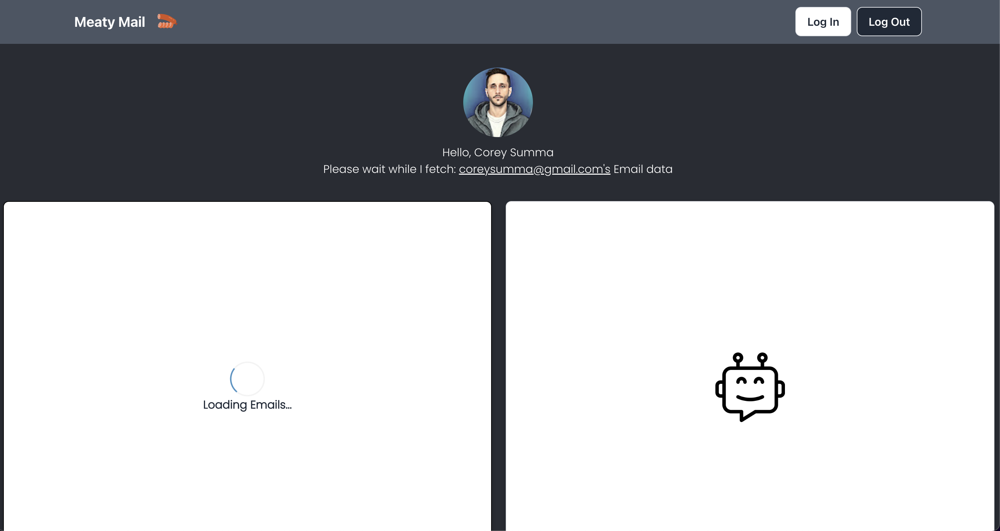

# Meaty Mail

## Screen Shot:

## Description:
This application uses GoogleOauth2, React, Javascript, HTML, TailwindCSS, OpenAI API, and Gmail API to fetch a list of the users email information to AI so a summary of the message can be generated on click.

## Using the App

- Login to your google account and allow access to email information (nothing is saved on this application or viewed by the developer, and google WILL warn you in order to give the proper permissions).

- Wait as the application loads your most recent Emails.

- Click on an email to view a short summary of the message.

